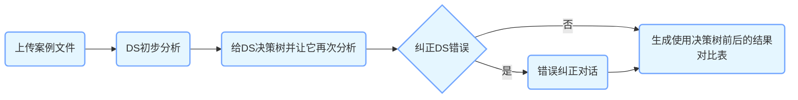

<!--
 * @Author: LetMeFly
 * @Date: 2025-02-06 08:59:49
 * @LastEditors: LetMeFly.xyz
 * @LastEditTime: 2025-02-12 16:32:35
-->
# SyntheticHybridYardstick(SHY) - 综合决策树与API的评估标尺

让DeepSeek(以下可能简称DS)分别不依据和依据决策树判决一个案例并对比判决结果生成表格

+ S = Synthetic（综合智能）
+ H = Hybrid（混合方法）
+ Y = Yardstick（评估基准）

## 流程



### 总述

1. 给DeepSeek一个彩礼纠纷相关的案例让DeepSeek判决应该返还多少彩礼
1. 给DeepSeek一个写好的法律判决决策树（By [shykeke](https://web.letmefly.xyz/He0/shykeke/)）让它重判
1. (Optional)告诉DS哪里判断错误了，需要xx修改
1. 让DeepSeek生成一个使用决策树前后判断结果的对比表格

### 细节

1. 上传案例（doc或docx），自动去重（保存到`case/{文件md5}`下）
1. Python读案例（docx to text）
2. 调用API接口和DS初次对话
3. 调用API接口和DS再次对话
4. 询问是否有需要修改的地方，如果有就不断调用API和DS对话让它修改
5. 调用API和DS对话让它总结使用决策树前后判决结果关系

## How to use

1. 安装[Python](https://www.python.org/downloads/)
2. 安装所需包

    ```bash
    pip install requests
    pip install flask
    pip install watchdog
    ```

    如果你只上传`.txt`格式的案例（最好utf-8编码），那么你可以**跳过这一步**了。

    如果你还想上传`.docx`格式的案例，你需要在电脑上安装`pandoc`并加入环境变量，并执行：

    ```bash
    pip install pypandoc
    ```

    如果你还想上传`.doc`格式的案例，你**还**需要：
    
    + 如果你是苹果用户/Linux用户

        你需要安装libreoffice并添加到环境变量，并执行：

        ```bash
        pip install unoconv
        ```

    + 如果你是Windows用户

        ```bash
        pip install win32
        ```

3. 在[硅基流动](https://cloud.siliconflow.cn/i/ssNAhfo3)或[腾讯lkeap](https://curl.qcloud.com/vV2VJa9h)注册API，在`main.py`同级目录下新建文件`password`，并输入你的api。

    默认调用的是腾讯的Deepseek-R1模型，如果你使用其他api，更改源码中的api地址和模型名称即可。

4. 原神·启动！

    ```bash
    python main.py
    ```

    之后你就可以上传案例，进行分析并统筹分析进度了。

## 特色不足

### 特色

+ `/chat`页面支持流式对话，实时显示大模型响应
+ 案件列表由EventStream更新，仅当`case`文件夹下某`config.json`更新时`增量`发送；某进度新完成时前端实时响应
+ 案例自动去重，重复上传只会覆盖上次文件名
+ 对话进度支持中断重连继续进行

### 不足

+ 不支持删除文件（除非手动删除`case/{md5}`整个文件夹并重启程序）
+ 多个网页端同时访问一个实时对话接口可能会导致每个接口的得到的数据都不完全
+ 设置首页案例进程“progress”接口的队列最大长度，若没有前端消费者则后端队列长度会在config.json变化时不断边长。

## End

+ [在线文档](http://shy-ds.letmefly.xyz/)
+ [项目地址](https://github.com/LetMeFly666/SyntheticHybridYardstick)
